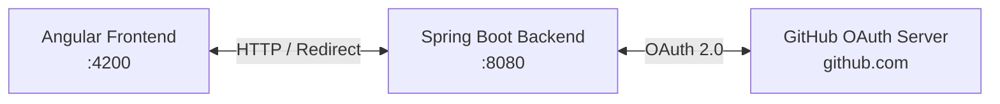
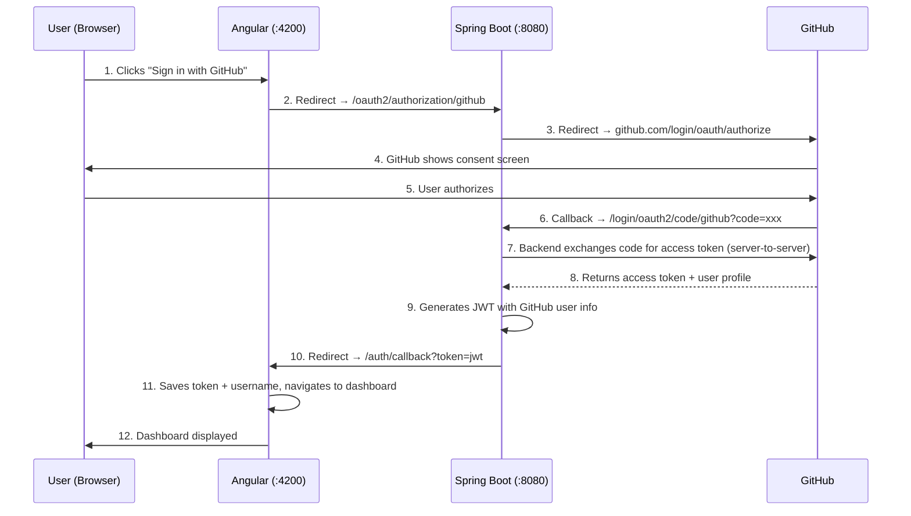
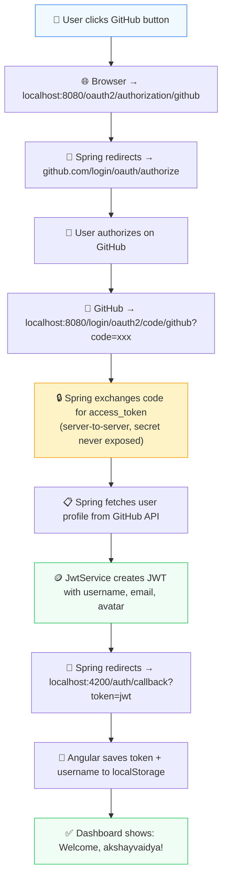

# GitHub OAuth 2.0 — End-to-End Flow

This document traces the complete GitHub OAuth 2.0 **Authorization Code** flow through your application, step by step, mapping each phase to the exact files in your codebase.

## Architecture Overview



Your app uses **3 actors**: the Angular frontend, the Spring Boot backend, and GitHub's OAuth server. The backend acts as the **OAuth client** — it never exposes your client secret to the browser.

---

## Sequence Diagram



---

## Step-by-Step Breakdown

### Step 1 — User Clicks "Sign in with GitHub"

> **File:** [login.html](file:///Users/akshayvaidya/akshayProjects/SpringBoot/outh_security/authenticator-app/src/app/components/login/login.html#L28-L34)

```html
<button type="button" class="btn-github" (click)="loginWithGithub()">
    <svg>...</svg>
    Sign in with GitHub
</button>
```

The user sees the GitHub button on the login page and clicks it. This calls `loginWithGithub()` in the component.

> **File:** [login.ts](file:///Users/akshayvaidya/akshayProjects/SpringBoot/outh_security/authenticator-app/src/app/components/login/login.ts#L100-L102)

```typescript
loginWithGithub() {
    this.integration.loginWithGithub();
}
```

This delegates to the integration service.

---

### Step 2 — Angular Redirects to Spring Boot

> **File:** [integration.ts](file:///Users/akshayvaidya/akshayProjects/SpringBoot/outh_security/authenticator-app/src/app/services/integration.ts#L47-L50)

```typescript
loginWithGithub() {
    window.location.href = 'http://localhost:8080/oauth2/authorization/github';
}
```

This performs a **full-page redirect** (not an AJAX call) to Spring Boot's built-in OAuth2 authorization endpoint. The browser leaves Angular entirely at this point.

> [!IMPORTANT]
> This is a `window.location.href` redirect, NOT an HTTP API call. The browser navigates away from Angular to the backend URL.

---

### Step 3 — Spring Boot Redirects to GitHub

> **File:** [application.properties](file:///Users/akshayvaidya/akshayProjects/SpringBoot/outh_security/backend_security/src/main/resources/application.properties#L2-L4)

```properties
spring.security.oauth2.client.registration.github.client-id=${GITHUB_CLIENT_ID}
spring.security.oauth2.client.registration.github.client-secret=${GITHUB_CLIENT_SECRET}
spring.security.oauth2.client.registration.github.redirect-uri=http://localhost:8080/login/oauth2/code/github
```

> **File:** [SecurityConfig.java](file:///Users/akshayvaidya/akshayProjects/SpringBoot/outh_security/backend_security/src/main/java/com/demo/outh_security/config/SecurityConfig.java#L53-L55)

```java
.oauth2Login(oauth2 -> oauth2
        .successHandler(successHandler())
)
```

When the browser hits `/oauth2/authorization/github`, Spring Security's **OAuth2AuthorizationRequestRedirectFilter** automatically:

1. Generates a random `state` parameter (CSRF protection)
2. Builds the GitHub authorization URL
3. Redirects the browser to:

```
https://github.com/login/oauth/authorize
    ?client_id=YOUR_CLIENT_ID
    &redirect_uri=http://localhost:8080/login/oauth2/code/github
    &scope=read:user
    &state=random_string
```

> [!NOTE]
> You never write this redirect logic yourself. Spring Boot's `spring-boot-starter-security-oauth2-client` does it automatically by convention when it sees the `github` registration in `application.properties`.

---

### Step 4 & 5 — GitHub Consent & Authorization

GitHub shows a consent screen to the user asking: *"Do you want to authorize this application?"*

Once the user clicks **"Authorize"**, GitHub redirects the browser back to your **backend** (not Angular):

```
http://localhost:8080/login/oauth2/code/github?code=AUTHORIZATION_CODE&state=random_string
```

The `code` is a **one-time-use authorization code** that can only be exchanged server-side.

---

### Step 6 & 7 — Backend Exchanges Code for Access Token

This is handled entirely by Spring Security's **OAuth2LoginAuthenticationFilter** — no code to write.

Spring Boot makes a **server-to-server** POST request to GitHub (invisible to the browser):

```
POST https://github.com/login/oauth/access_token

    client_id=YOUR_CLIENT_ID
    client_secret=YOUR_CLIENT_SECRET    ← never exposed to browser
    code=AUTHORIZATION_CODE
    redirect_uri=http://localhost:8080/login/oauth2/code/github
```

GitHub responds with an **access token**.

> [!IMPORTANT]
> This is the key security benefit of the Authorization Code flow — the `client_secret` and `access_token` never touch the browser. They only exist on the server.

---

### Step 8 — Spring Boot Fetches User Profile from GitHub

Using the access token, Spring Boot automatically calls GitHub's user API:

```
GET https://api.github.com/user
Authorization: Bearer ACCESS_TOKEN
```

GitHub returns the user's profile:
```json
{
    "login": "akshayvaidya",
    "email": "akshay@example.com",
    "avatar_url": "https://avatars.githubusercontent.com/u/12345"
}
```

Spring Security wraps this into an `OAuth2User` object and creates an `Authentication`.

---

### Step 9 — Backend Generates JWT

> **File:** [SecurityConfig.java → successHandler()](file:///Users/akshayvaidya/akshayProjects/SpringBoot/outh_security/backend_security/src/main/java/com/demo/outh_security/config/SecurityConfig.java#L61-L67)

```java
@Bean
public AuthenticationSuccessHandler successHandler() {
    return (request, response, authentication) -> {
        String jwt = jwtService.generateToken(authentication);
        response.sendRedirect("http://localhost:4200/auth/callback?token=" + jwt);
    };
}
```

The success handler fires after GitHub authentication completes. It calls `JwtService.generateToken()`.

> **File:** [JwtService.java → generateToken(Authentication)](file:///Users/akshayvaidya/akshayProjects/SpringBoot/outh_security/backend_security/src/main/java/com/demo/outh_security/service/JwtService.java#L27-L42)

```java
public String generateToken(Authentication authentication) {
    OAuth2User oAuth2User = (OAuth2User) authentication.getPrincipal();
    String username = oAuth2User.getAttribute("login");
    String email = oAuth2User.getAttribute("email");
    String avatarUrl = oAuth2User.getAttribute("avatar_url");

    return Jwts.builder()
            .setSubject(username)           // GitHub username
            .claim("email", email)
            .claim("avatar_url", avatarUrl)
            .claim("provider", "github")
            .setIssuedAt(new Date())
            .setExpiration(new Date(System.currentTimeMillis() + EXPIRATION_TIME))
            .signWith(getSignKey(), SignatureAlgorithm.HS256)
            .compact();
}
```

This extracts GitHub user attributes from the `OAuth2User` and packs them into a JWT. The JWT payload looks like:

```json
{
    "sub": "akshayvaidya",
    "email": "akshay@example.com",
    "avatar_url": "https://avatars.githubusercontent.com/u/12345",
    "provider": "github",
    "iat": 1717776000,
    "exp": 1717779600
}
```

---

### Step 10 — Backend Redirects to Angular with JWT

The `successHandler` then redirects the browser back to Angular:

```
HTTP 302 → http://localhost:4200/auth/callback?token=eyJhbGciOiJIUzI1NiJ9...
```

The JWT is passed as a query parameter. The browser is now back in Angular territory.

---

### Step 11 — Angular Callback Saves Token & Username

> **File:** [app.routes.ts](file:///Users/akshayvaidya/akshayProjects/SpringBoot/outh_security/authenticator-app/src/app/app.routes.ts#L10)

```typescript
{path:'auth/callback', component: Callback}
```

The route matches and loads the `Callback` component.

> **File:** [callback.ts](file:///Users/akshayvaidya/akshayProjects/SpringBoot/outh_security/authenticator-app/src/app/auth/callback/callback.ts#L14-L33)

```typescript
ngOnInit() {
    const token = this.route.snapshot.queryParamMap.get('token');
    if (token) {
        localStorage.setItem('token', token);

        // Decode JWT payload to extract username
        try {
            const payload = token.split('.')[1];
            const decoded = JSON.parse(atob(payload));
            if (decoded.sub) {
                localStorage.setItem('username', decoded.sub);
            }
        } catch (e) {
            console.error('Failed to decode JWT:', e);
        }

        this.router.navigate(['/dashboard']);
    } else {
        this.router.navigate(['/login']);
    }
}
```

This component:
1. Reads the `token` query parameter
2. Saves it to `localStorage`
3. Decodes the JWT payload (base64) to extract the `sub` claim (GitHub username)
4. Saves the username to `localStorage`
5. Navigates to `/dashboard`

---

### Step 12 — Dashboard Displays User Info

> **File:** [dashboard.ts](file:///Users/akshayvaidya/akshayProjects/SpringBoot/outh_security/authenticator-app/src/app/components/dashboard/dashboard.ts#L22-L31)

```typescript
ngOnInit(): void {
    const storedUsername = this.integration.getUsername();
    if (storedUsername) {
        this.username.set(storedUsername);   // Shows GitHub username
    }
    const storedToken = this.integration.getToken();
    if (storedToken) {
        this.token.set(storedToken);        // Shows the JWT
    }
}
```

> **File:** [auth.guard.ts](file:///Users/akshayvaidya/akshayProjects/SpringBoot/outh_security/authenticator-app/src/app/guards/auth.guard.ts#L5-L16)

The `authGuard` allows access because `integration.isLoggedIn()` returns `true` (token exists in localStorage). The dashboard loads with the GitHub username.

---

## Complete Data Flow Summary



## What Lives Where

| What | Where | Exposed to Browser? |
|---|---|---|
| `client_id` | [application.properties](file:///Users/akshayvaidya/akshayProjects/SpringBoot/outh_security/backend_security/src/main/resources/application.properties#L2) (env var) | ✅ Yes (in GitHub redirect URL — this is safe) |
| `client_secret` | [application.properties](file:///Users/akshayvaidya/akshayProjects/SpringBoot/outh_security/backend_security/src/main/resources/application.properties#L3) (env var) | ❌ **Never** — only used server-to-server |
| `authorization_code` | GitHub → Spring Boot callback URL | ❌ Seen by browser briefly, but one-time-use |
| `access_token` | Spring Boot only (from GitHub's token endpoint) | ❌ **Never** — stays on backend |
| `JWT` | Spring Boot → Angular (via redirect URL) | ✅ Yes — this is your session token |
| `username` | Decoded from JWT in Angular | ✅ Yes — display only |

> [!TIP]
> The **Authorization Code flow** is the most secure OAuth pattern for web apps because the `client_secret` and GitHub `access_token` never leave your server. The browser only ever sees the JWT that you control.
